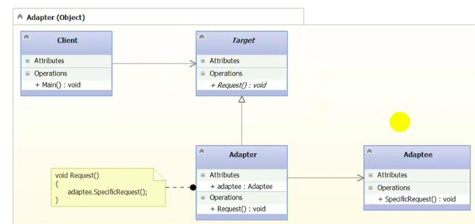

## Міністерство освіти і науки України

## Львівського національного університету ветеринарної медицини та біотехнологій імені С.З. Ґжицького
 
# Звіт
### про виконання лабораторної роботи з дисципліни Об'єктно-орієнтоване програмування №12 на тему "Структурні шаблони проєктування"
Виконав студент групи ІТ-32

Прийняв доц. Н. Заплатинський
### Львів 2025

## Мета роботи
Мета роботи - познайомитися з групою структурних шаблонів проєктування.

Структурні патерни GoF (Structural Patterns) — це група патернів проєктування, які допомагають будувати гнучкі структури з класів та об’єктів, спрощувати їх взаємодію та робити архітектуру більш зрозумілою та масштабованою.
Вони описують як компоненти пов’язані між собою і як організувати ці зв’язки так, щоб система була простою, гнучкою та легко змінюваною.

Адаптер — це патерн проектування, який дозволяє об'єктам з несумісними інтерфейсами працювати разом та дозволяє підключати старий або сторонній код.
Він працює як міст між двома інтерфейсами, дозволяючи класам, які не могли б працювати разом, спілкуватися шляхом перетворення інтерфейсу класу в інший інтерфейс, якого очікують клієнти.

Адаптери бувають двох видів:
#### Object Adapter (найпоширеніший). Працює через композицію.
✔ Переваги:
- можна адаптувати багато різних класів
- дотримується принципу композиції
#### Class Adapter. Працює через успадкування.
Використовує множинне успадкування інтерфейсу і класу (в C# — тільки інтерфейс + клас).
Недоліки:
 - прив'язка до конкретного класу
 - не можна адаптувати кілька класів


## Хід роботи

1. Створив С# [проєкт](./AdapterObjectLevel/) в якому навів приклад який реалізує шаблон Adapter. 
2. Структура проєкту

### Target — інтерфейс, який очікує клієнт
```csharp
abstract class Target
{
    public abstract void Request();
}
```
### Adaptee — клас, який має реалізацію інтерфейсу яку потрібно "підсунути" клієнту.

```csharp
class Adaptee
{
    public void SpecificRequest()
    {
        Console.WriteLine("Specific Request;");
    }
}
```
### Adapter — клас, що перетворює виклики
```csharp
class Adapter : Target
{
    private Adaptee _adaptee = new Adaptee();
    public override void Request()
    {
        _adaptee.SpecificRequest();
    }
}
```

## Висновки
Реалізував приклад патерну Adapter який:
- робить можливим використання стороннього або legacy коду.
- дозволяє не міняти клієнтський код
- ізолює залежності.